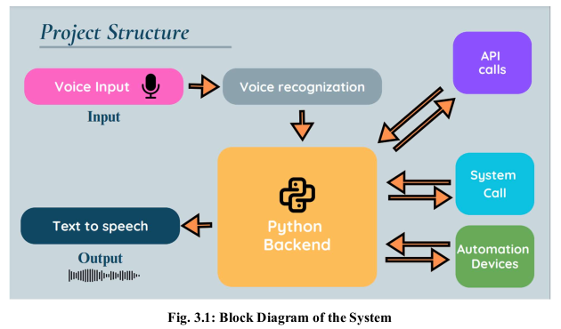
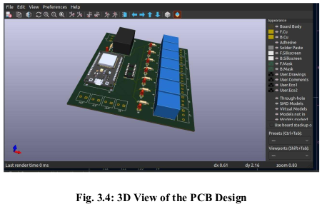

# 🌟 Multi-Modal AI Voice Assistant with Integrated Home Automation  

> **Your voice. Your home. Your control.**  
> AI-powered voice assistant that bridges **digital automation** and **physical IoT control** — customizable, affordable, and future-ready.

---

## 🖼 Project at a Glance

> A seamless pipeline:  
> 🎤 Voice Input → 🧠 AI Processing → 💻 Desktop Automation / 🏠 IoT Device Control → 🔊 Spoken Feedback

---

## ✨ Why This Project?
Existing smart assistants are often **expensive**, **locked-down**, and **limited in customization**.  
The **Multi-Modal AI Voice Assistant** changes that by combining:
- **AI-powered natural voice control**
- **Desktop automation tools**
- **Custom PCB-based IoT control**
- **API-driven real-time data**

It’s designed to **adapt to your needs**, whether at home, in the office, or in specialized industrial settings.

---

## 🚀 Key Highlights

| Feature | What It Does |
|---------|--------------|
| 🎙 Natural Voice Interaction | Wake word + accurate speech-to-text |
| 🖥 Desktop Automation | Screenshots, webcam captures, clipboard reading |
| 🏠 Smart Home Control | ESP32 + 7-channel relay for appliances |
| 🔊 Conversational Feedback | AI-generated TTS |
| 🌐 Live Data Access | Weather, news, and more |
| ⚡ Custom Hardware | Reliable, compact, and expandable |

---

## 🛠 Hardware in Action

**Custom PCB Includes:**
- ESP32 Microcontroller  
- ULN2003 Relay Driver  
- 7-Channel Relay Control  
- Power Regulation via AMS1117 & Hi-Link HLK-PM01  

---

## 🧠 How It Works

1. **Listen** – Wake word triggers listening mode.
2. **Understand** – AI interprets your voice command.
3. **Act** –  
   - **Digital tasks** → Control desktop via Python modules.  
   - **Physical tasks** → Send HTTP commands to ESP32 for relay switching.
4. **Respond** – Spoken confirmation or requested data.

---

## 🎯 Ideal For
- 🏡 **Homeowners** – Affordable smart home control.
- 🛠 **DIY Makers** – Fully customizable, open-source build.
- 🎓 **Students** – AI + IoT learning platform.
- 🏢 **Businesses** – Automate offices, retail, or hospitality.

---

## 🔮 Roadmap
- 📡 Offline voice control for low-internet environments.
- 🤖 Predictive automation using machine learning.
- 📲 Mobile app for remote control.
- 🔗 Alexa/Google Home ecosystem integration.
- 🌍 Multi-language voice support.

---

## 🎥 Demo Preview
*(Coming soon — GIF showing a voice command turning on a light)*

---

## 📜 License
Licensed under the **MIT License** — use, modify, and innovate freely.

---

💡 *With AI + IoT in your hands, automation becomes limitless.*  

